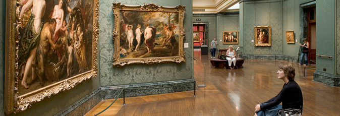
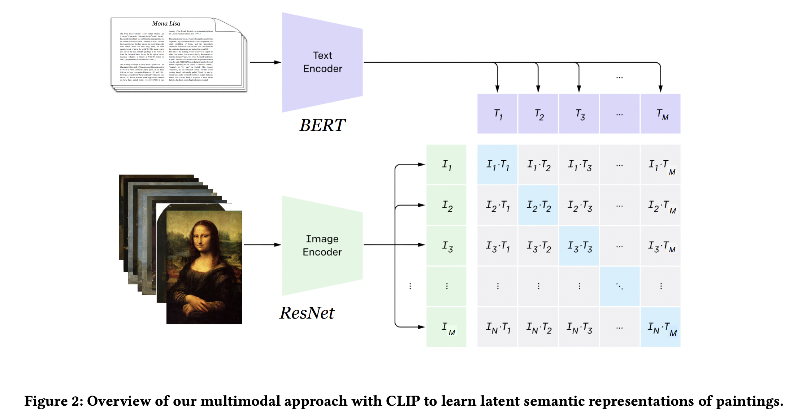
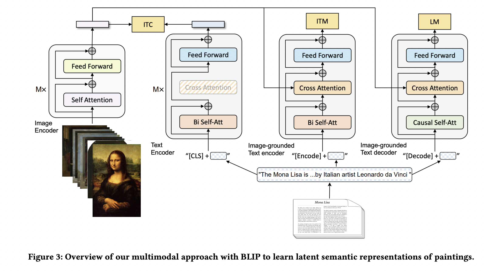

# MRL_VA_RecSys

The official implementation of <B>"Together Yet Apart: Multimodal Representation Learning for
Personalised Visual Art Recommendation"</B> [Paper]([https://orbilu.uni.lu/handle/10993/55026](https://dl.acm.org/doi/abs/10.1145/3565472.3592964)) which will appear in the Proceedings of the ACM Conference on User Modeling,
Adaptation and Personalization [(UMAP 2023).](https://www.um.org/umap2023/)
<p align="center">
 
</p>

<p align="center">
 
</p>
<p align="center">
 
</p>
<p align="center">
 
</p>

## Setup 

See [RecSys engine instructions](RecSys_engines/README.md) for setting up the Recommendation services.

Citation
========

When you use this work or method for your research, we ask you to cite the following publication:


[Bereket A. Yilma, Luis A. Leiva: Together Yet Apart: Multimodal Representation Learning for
Personalised Visual Art Recommendation, Proceedings of the ACM Conference on on User Modeling,
Adaptation and Personalization (UMAP 2023).](https://dl.acm.org/doi/10.1145/3565472.3592964)

``` bibtex

@inproceedings{10.1145/3565472.3592964,
author = {Yilma, Bereket A. and Leiva, Luis A.},
title = {Together Yet Apart: Multimodal Representation Learning for Personalised Visual Art Recommendation},
year = {2023},
isbn = {9781450399326},
publisher = {Association for Computing Machinery},
address = {New York, NY, USA},
url = {https://doi.org/10.1145/3565472.3592964},
doi = {10.1145/3565472.3592964},
pages = {204–214},
numpages = {11},
keywords = {Recommendation, Personalization, Artwork, User Experience, Machine Learning},
location = {Limassol, Cyprus},
series = {UMAP '23}
}

```
