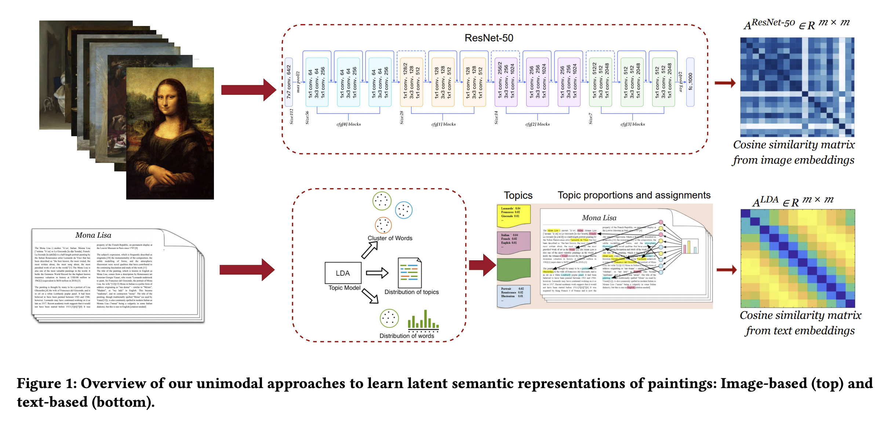

# MRL_VA_RecSys

The official implementation of <B>"Together Yet Apart: Multimodal Representation Learning for
Personalised Visual Art Recommendation"</B> [Paper]() which will appear in the Proceedings of the ACM Conference on User Modeling,
Adaptation and Personalization [(UMAP 2023).](https://www.um.org/umap2023/)

 

 

 

 

## Setup 

See [RecSys engine instructions](RecSys_engines/README.md) for setting up the Recommendation services.
